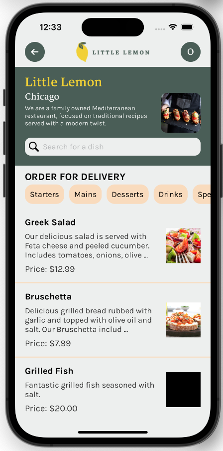

# Little Lemon Capstone Project

## Introduction
This is a capstone project for the Coursera React Native Specialization.
https://www.coursera.org/specializations/meta-react-native
## Installation

The project requires Expo to run. You can install Expo by running the following command in the terminal:
```bash
yarn global add expo-cli
```
You will also need to install the Expo app on your phone to run the project on your phone.

To install the project, you can clone the repository and run the following command in the terminal:
```bash
yarn install
```

## Usage
To run the project, you can run the following command in the terminal:
```bash
yarn start
```



